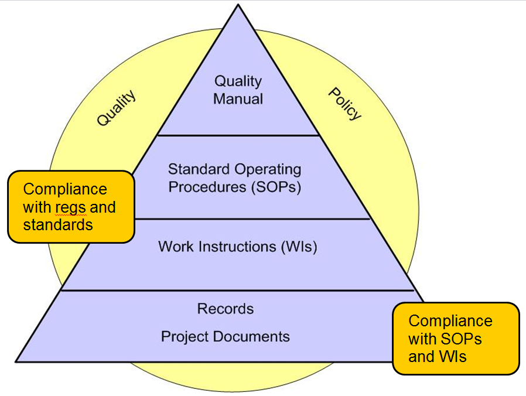

# __NewInstitue__ Quality Manual
## QM-001
----------------------------------------------------------------------

## 1.0 PURPOSE

__NewInstitue__ is a health-sciences focused institute that designs and 
conducts *clinical investigations* by collecting human health data in order to
answer specific scientific questions.

This Quality Manual (QM) establishes the Quality Management System (QMS) for
__NewInstitue__.  Policies and procedures required for compliance are shown 
using the word **“SHALL”**.

This QMS complies with applicable sections of ISO-9001:2015, ISO-19011:2018, 
ICH E6(R2), ICH E8(R1), applicable Clinical Trials Guidance Documents published
by the FDA and international standards.

*Clinical Investigations* conducted by __NewInstitue__ are conducted in
accordance with this QMS and in a manner consistent with best practices.

This QMS adopts the definition of *Clinical Investigation* used in
[21 CFR 50.3(c)](https://www.ecfr.gov/current/title-21/part-50/section-50.3#p-50.3(c))

>   Any experiment that involves a test article and one or more human subjects
    and that either is subject to requirements for prior submission to the Food
    and Drug Administration under section 505(i) or 520(g) of the act, or is
    not subject to requirements for prior submission to the Food and Drug
    Administration under these sections of the act, but the results of which
    are intended to be submitted later to, or held for inspection by, the Food
    and Drug Administration as part of an application for a research or
    marketing permit

## 2.0 SCOPE

This Quality Manual defines policies and procedures related to the design and
conduct of *clinical investigations* as defined by the US FDA in [21 CFR 50.3(c)](https://www.ecfr.gov/current/title-21/part-50/section-50.3#p-50.3(c))

All __NewInstitue__ employees and subcontractors are required to adhere to the
policies and procedures outlined in this Quality Manual when designing and
conducting *clinical investigations*.

__NewInstitue__ does not perform *clinical investigations* of drugs, biologics,
or pharmaceutical products.  Therefore, the following standards and guidance
documents are not considered by this QMS

-   ICH E3: Structure and Content of Clinical Study Reports
-   ICH Q9: Quality Risk Management of pharmaceutical quality
-   ICH E2A:  Clinical Safety Data Management: Definitions and Standards for Expedited Reporting
-   FDA Guidance on Data Integrity and Compliance (2018)

Furthermore, __NewInstitue__ does not perform *clinical investigations* to asses
the performance, effectiveness, and/or safety of medical devices.  Therefore
the following standards and guidance documents are not considered by this QMS

-   ISO-14155: *Clinical investigation* of medical devices for human subjects

## 3.0 REFERENCES, TERMS AND ACRONYMS

### 3.1 References
----------------------------------------------------------------------

- ISO-9001:2015

- ISO-19011:2018

- ICH E6(R2)

- ICH E8(R1)

- GAMP v5

- NIST 800-171

- NIST 800-53

- [FDA's Clinical Trials Guidance Documents](https://www.fda.gov/science-research/clinical-trials-and-human-subject-protection/clinical-trials-guidance-documents): The FDA's list of guidance documents that represents the agency's current thinking on the conduct of clinical trials, good clinical practice and human subject protection.

### 3.2 __NewInstitue__ Procedures 
----------------------------------------------------------------------

1.  SOP-001: Design Controls Procedure

2.  SOP-002: Document and Records Controls Procedure

3.  SOP-003: Risk Management and Quality Risk Management Procedure

4.  SOP-004: Computer System Validation, Data Integrity and Data Management Procedure

5.  SOP-005: Study Design Review Procedure

6.  SOP-006: Outsourced Activities Procedure

7.  SOP-007: Investigational Product Management Procedure

8.  SOP-008: Subject Safety and Adverse Event Management Procedure

9.  SOP-009: Monitoring and Oversight Procedure

10. SOP-010: Control of Nonconforming Clinical Investigation Activities Procedure

11. SOP-011: Corrective and Preventive Action Procedure

12. SOP-012: Internal and External Audit Procedure

13. SOP-013: Change Control Procedure

14. SOP-014: Regulatory Compliance Management Procedure

### 3.3 Terms
----------------------------------------------------------------------

-   **Clinical Investigation**: The FDA cites the following CFRs for their
    definition of *clinical investigation*: [21 CFR 50.3(c)](https://www.ecfr.gov/current/title-21/part-50/section-50.3#p-50.3(c)), [56.102(c)](https://www.ecfr.gov/current/title-21/part-56/section-56.102#p-56.102(c)), 
    [312.3(b)](https://www.ecfr.gov/current/title-21/part-312/section-312.3#p-312.3(Clinical%20investigation))
    and [812.3(h)](https://www.ecfr.gov/current/title-21/part-812/section-812.3#p-812.3(h)).
    This QMS adopts the definition from 21 CFR 50.3(c): any experiment that
    involves a test article and one or more human subjects and that either is
    subject to requirements for prior submission to the Food and Drug
    Administration under section 505(i) or 520(g) of the act, or is not subject
    to requirements for prior submission to the Food and Drug Administration
    under these sections of the act, but the results of which are intended to
    be submitted later to, or held for inspection by, the Food and Drug
    Administration as part of an application for a research or marketing permit.

### 3.4 Acronyms
----------------------------------------------------------------------

- **CAPA**:  Corrective and Preventive Action

- **CFR**:   Code of Federal Regulations

- **CRO**:   Contract Research Organization

- **FDA**:   U.S. Food and Drug Administration

- **GAMP**:  Good Automated Manufacturing Practice

- **GCP**:   Good Clinical Practice

- **ICH**:   The International Council for Harmonisation of Technical
             Requirements for Pharmaceuticals for Human Use

- **ISO**:   International Organization for Standardization

- **NIST**:  National Institute of Standards and Technology

- **QM**:    Quality Manual

- **QMS**:   Quality Management System

- **SOP**:   Standard Operating Procedure

- **TMF**:   Trial Master File

- **WI**:    Work Instruction

## 4.0 QMS OVERVIEW

### 4.1 General Requirements
----------------------------------------------------------------------

This QMS applies to *clinical investigations* designed and conducted by
__NewInstitue__. All __NewInstitue__ employees and subcontractors who are
involved in the design and conduct of *clinical investigations* are responsible
for understanding and complying with applicable provisions of this Quality
Manual (QM) and the __NewInstitue__ QMS. __NewInstitue__ Executive Management
is ultimately responsible for assuring that personnel can and do comply with all
provisions of the QM and the QMS.

The QM identifies several Standard Operating Procedures (SOPs) and Work
Instructions (WIs). These SOPs and WIs identify activities, documents and
records to be produced as part of designing and conducting *clinical
investigations*. Documents may include specifications, study plans, reports,
etc. Records may include meeting minutes, test results, etc. and provide
evidence that activities required by SOPs have been performed.

__NewInstitue__ Executive Management is responsible for periodically assessing
the effectiveness of the QMS against defined quality objectives in order to
ensure __NewInstitue__'s *clinical investigations* are developed and conducted
in a manner consistent with the QMS and that its *clinical investigations* are
conducted ethically and produce high-quality, reliable scientific data.

The following processes have been identified as critical to the design and
conduct of ethical and reliable *clinical investigations*:

-   Design Controls
-   Document and Records Controls
-   Risk Management and Quality Risk Management
-   Computer System Validation, Data Integrity and Data Management
-   Outsourced Activities
-   Internal and External Audits
-   Training and Competency Management
-   Investigational Product Management
-   Subject Safety and Adverse Event Management
-   Monitoring and Oversight
-   Corrective and Preventive Actions (CAPA)
-   Management Review and Quality Planning
-   Change Control
-   Regulatory Compliance Management

### 4.2 QMS Documentation
----------------------------------------------------------------------

Documentation is the cornerstone of an effective QMS. __NewInstitue__
**“SHALL”** establish and maintain procedures for the control of documents and
records related to the design, conduct, validation and support of all
*clinical investigations* under this QMS.

The QMS documentation hierarchy is shown in Figure 1 and includes:

- This Quality Manual (QM)

- SOPs and WIs as required by this QM and applicable guidance documents and
international standards

- Study documents needed by __NewInstitue__ to ensure the effective planning,
operation and control of its processes

- Records required by SOPs and WIs

> 
> Figure 1 – Hierarchy of QMS Documentation

The purpose of each level of documentation is as follows:

-   The **Quality Manual** provides a description of the __NewInstitue__
    quality policy and the general structure and methods for maintaining
    the quality system. It provides policies, broad scopes of
    responsibilities and authorities. This QM establishes compliance
    with relevant regulations, guidance documents and
    international standards. It identifies requirements (indicated by
    the word **“SHALL”**) for creating SOPs, WIs, study documents
    and records.

-   **SOPs** are high-level procedures used to specify *what* needs to
    be done, by whom, when, and the records that are produced as
    evidence that the activity was executed as required.

-   **WIs** are detailed documents used to specify *how* some activity
    or operation is to be done, by whom, when it is done, and the
    records produced as evidence that the activity was executed
    as required.

-   **Records** provide evidence that activities prescribed in SOPs and
    WIs were performed.

-   **Study documents** are documents produced as part of clinical
    investigation design, conduct, and reporting activities. These may
    include protocols, case report forms, monitoring reports, safety reports,
    statistical analysis plans, and other documents based on individual study
    requirements. The specific documents to be produced are defined in the
    study plan/protocol.

## 5.0 MANAGEMENT RESPONSIBILITY

### 5.1 Management Commitment
----------------------------------------------------------------------

__NewInstitue__'s Executive Management is committed to implementing an
effective QMS that addresses all relevant aspects of clinical investigation
design, conduct, reporting and support. This commitment is demonstrated through
the establishment of the QMS and the Quality Policy (shown below) and is
supported by providing the necessary resources, equipment and appropriately
trained staff.

### 5.2 Quality Policy
----------------------------------------------------------------------

__NewInstitue__'s quality policy is as follows:

>   __NewInstitue__ collects high quality, multi-modal human health data in
    order to answer specific research questions to better understand the nature
    of various diseases, human health and longevity.  Data is collected, stored,
    transmitted, analyzed and distributed ethically and in accordance with the
    consent of the subjects and in a manner that protects their privacy.

### 5.3 Resources 
----------------------------------------------------------------------

#### 5.3.1 Organization

The functional organization chart included as [Appendix A](QM-001--QualityManual.md#appendix-a-newinstitues-organization-chart) summarizes how __NewInstitue__ is structured to ensure responsibilities
and authorities are defined and communicated within the organization with
regard to the design and conduct of *clinical investigations*.

__NewInstitue__ clearly establishes and documents the responsibilities,
authority, and interrelation of employees who manage, perform, and verify work
which affects quality as shown in [Appendix A](QM-001--QualityManual.md#appendix-a-newinstitues-organization-chart).

All employees assigned to a *clinical investigation* must have requisite
training as identified in the applicable Clinical Study Protocol.

#### 5.3.2 Management Representative Responsibilities

__NewInstitue__ **SHALL** appoint a Management Representative with the
following minimum responsibilities:

-   Authority to prevent initiation or continuation of *clinical investigations*
    that do not meet quality standards or regulatory requirements until the
    deficiency or unsatisfactory condition is corrected. When a dispute occurs
    concerning the quality of a *clinical investigation*, the issue is brought
    before Executive Management for resolution.

-   Promotes awareness of Good Clinical Practice (GCP) requirements, 
    subject safety, and data integrity throughout the organization.

-   Responsible for coordinating visits by regulatory authorities with
    __NewInstitue__ and for coordinating all responses to regulatory inquiries
    and inspections.

-   Responsible for coordinating periodic internal audits of all clinical
    investigation activities covered by this Quality Manual. Internal Audits
    are described in [section 8.3](QM-001--QualityManual.md#83-internal-and-external-audits)
    below.

-   Maintains this Quality Manual and distributes controlled copies of
    the Quality Manual.
    
-   Proposes changes to the Quality Manual that are discussed and
    reviewed with staff. Executive Management reviews these changes.

-   Responsible for removing obsolete Quality Manual revisions and
    making the most recently approved revision available to the staff.

-   Oversees the Trial Master File (TMF) completeness and quality

-   Coordinates safety reporting obligations and ensures timely adverse event
    reporting

-   Maintains oversight of investigator qualifications and training compliance

#### 5.3.3 Management Reviews

__NewInstitue__ **SHALL** conduct an annual Management Review. This review
assesses the continuing QMS suitability, adequacy and effectiveness,
identifying opportunities for improvement and needed changes. At each
Management Review meeting, the following topics MAY be considered for
discussion:

-   Status of all *clinical investigation* activities and study portfolio

-   Subject safety, adverse events, and data integrity issues

-   Regulatory, GCP and compliance issues

-   Issues with Contract Research Organizations (CROs) and other outsourced
    service providers

-   QMS issues

-   Staff training needs and investigator qualification requirements

-   Systems, equipment and infrastructure needs to support clinical
    investigations and the QMS

-   Results of audits (internal, regulatory, and sponsor audits)

-   Investigator and institutional feedback

-   Process performance and study conduct quality

-   Status of preventive and corrective actions (CAPA)

-   Follow-up actions from previous management reviews

-   Planned changes that could affect the quality management system

-   Recommendations for improvement

-   New or revised regulatory requirements and guidance documents

-   Trial Master File (TMF) completeness and quality metrics

-   Data management and monitoring effectiveness

-   Safety reporting compliance and timeliness

The Management Representative or designee **SHALL** maintain meeting minutes of
each Management Review. Meeting minutes of management reviews are filed
separately from any Trial Master File (TMF) as they are QMS documents and not
essential study documents subject to inspection.

## 6.0 RESOURCE MANAGEMENT 

### 6.1 Provision of Resources
----------------------------------------------------------------------

Executive Management is responsible for providing appropriate resources
to accomplish planned activities. Resources may include but not be
limited to:

-   People

-   Systems, equipment and infrastructure

Resources include those required to support the design, conduct, and reporting
of clinical investigations by __NewInstitue__.

Resources to be provided also include those required to implement, support,
maintain and improve the QMS.

#### 6.1.1 People

Executive Management shall ensure that all employees and subcontractors
involved in activities that affect the quality, safety and reliability of
*clinical investigations* conducted by __NewInstitue__ meet minimum levels of
competence.

Executive Management shall provide awareness training to all employees to make
certain that all employees are made aware of the:

-   Importance of their activities
-   How their activities affect the safety of study subjects and the
    reliability of clinical data
-   How their activities contribute to the achievement of the quality objectives
-   GCP principles and their legal and ethical responsibilities
-   Requirements for protection of subject rights, safety, and welfare
-   Data integrity principles and their role in maintaining data quality

All training requirements should be documented in each Clinical Study Protocol.
All training shall be documented in training records.

#### 6.1.2 Systems, Equipment and Infrastructure

Executive Management **shall** be responsible for deciding which clinical
investigations should be designed and conducted. For each of these
studies, Executive Management **shall** be responsible for providing
adequate systems, equipment, and infrastructure to support the design,
conduct, reporting and support of *clinical investigations* conducted under this
QMS.

## 7.0 STUDY REALIZATION
----------------------------------------------------------------------

Study realization activities include all activities required to design,
conduct, monitor, analyze, and report *clinical investigations* within this QMS.
These activities, at a minimum, shall include:

-   Design Controls (see [section 7.1](QM-001--QualityManual.md#71-design-controls))
-   Document and Records Controls (see [section 7.2](QM-001--QualityManual.md#72-document-and-records-controls))
-   Risk Management and Quality Risk Management (see [section 7.3](QM-001--QualityManual.md#73-risk-management-and-quality-risk-management))
-   Computer System Validation, Data Integrity and Data Management (see [section 7.4](QM-001--QualityManual.md#74-computer-system-validation-and-data-integrity))
-   Study Design Reviews (see [section 7.5](QM-001--QualityManual.md#75-study-design-reviews))
-   Outsourced Activities (see [section 7.6](QM-001--QualityManual.md#76-outsourced-activities))
-   Investigational Product Management (see [section 7.7](QM-001--QualityManual.md#77-investigational-product-management))
-   Subject Safety and Adverse Event Management (see [section 7.8](QM-001--QualityManual.md#78-subject-safety-and-adverse-event-management))

### 7.1 Design Controls
----------------------------------------------------------------------

__NewInstitue__ **SHALL** establish and maintain a Design Control procedure that
minimally addresses applicable requirements in ISO-9001:2015, ICH E6(R2),
ICH E8(R1), and applicable regulatory guidance documents.  All clinical
investigation design activities shall be performed and documented in accordance
with the Design Controls Procedure, SOP-001.

### 7.2 Document and Records Controls
----------------------------------------------------------------------

__NewInstitue__ **SHALL** establish and maintain a Document and Records Control
procedure that minimally addresses the document and record control requirements
contained in ISO-9001:2015, ICH E6(R2) Sections 4.9 and 8.0, and applicable
regulatory guidance documents.

Documents and records related to *clinical investigations* shall be created and
maintained in accordance with the Document and Records Controls Procedure,
SOP-002.

A Trial Master File (TMF) **SHALL** be created for each *clinical investigation*.
Study documents and records identified in the SOPs, work instructions, and
study plans **SHALL** be maintained in the TMF.

### 7.3 Risk Management and Quality Risk Management
----------------------------------------------------------------------

__NewInstitue__ **SHALL** establish and maintain a Risk Management and Quality
Risk Management procedure that minimally addresses applicable requirements in
ISO-9001:2015 Section 6.1, ICH E6(R2) Section 5.0, ICH E8(R1) Section 3.2 and
applicable FDA guidance documents.

All risk management activities related to *clinical investigations* **SHALL** be
performed and documented in accordance with the Risk Management and Quality
Risk Management Procedure, SOP-003.

### 7.4 Computer System Validation, Data Integrity and Data Management
----------------------------------------------------------------------

__NewInstitue__ **SHALL** establish and maintain a Computer System Validation,
Data Integrity and Data Management procedure that minimally addresses
applicable requirements in ISO-9001:2015 Section 6.1, 21 CFR Part 11, ICH E6(R2)
Section 5.5, GAMP 5, NIST 800-171, NIST 800-53, and applicable FDA guidance
documents.

All computer system validation, data integrity, and data management activities
related to *clinical investigations* shall be performed and documented in
accordance with the Computer System Validation, Data Integrity and Data
Management Procedure, SOP-004.

All computer systems used in *clinical investigations* shall be considered for
validation in accordance with GAMP 5 risk-based principles as described in the
Computer System Validation, Data Integrity and Data Management Procedure,
SOP-004.

All data integrity and data management activities related to *clinical
investigations* **SHALL** be performed and documented in accordance with the
Computer System Validation, Data Integrity and Data Management Procedure,
SOP-004

### 7.5 Study Design Reviews
----------------------------------------------------------------------

__NewInstitue__ **SHALL** establish and maintain a Study Design Review
procedure that minimally addresses applicable requirements in ISO-9001:2015 
Section 8.3, ICH E6(R2) Sections 5.0, 5.1 and 6.0, ICH E8(R1) Section 5, and
applicable regulatory guidance documents.

All Study Design Reviews related to *clinical investigations* shall be
performed and documented in accordance with the Study Design Review Procedure,
SOP-005.

### 7.6 Outsourced Activities
----------------------------------------------------------------------

__NewInstitue__ **SHALL** establish and maintain an Outsourced Activities
procedure that minimally addresses applicable requirements in ISO-9001:2015
Section 8.4 and ICH E6(R2) Sections 5.2 and 5.23 and the following:

-   Creation and maintenance of a Qualified Vendor List (QVL)
-   Vendor qualification for Contract Research Organizations (CROs),
    laboratories, data management services, statistical services, and other
    outsourced service providers

The conduct of *clinical investigations* may incorporate services provided by
CROs, central laboratories, and other service providers as well as custom
services developed by third parties to specifications prepared by
__NewInstitue__.

Outsourced activities related to *clinical investigations* shall be performed
and documented in accordance with the Outsourced Activities Procedure, SOP-006.

### 7.7 Investigational Product Management
----------------------------------------------------------------------

__NewInstitue__ **SHALL** establish and maintain an Investigational Product
Management procedure that minimally addresses applicable requirements in
ICH E6(R2) Sections 5.13 and 5.14 and the following:

-   **Accountability**: Procedures that describe how investigational products
    are tracked, dispensed, and accounted for throughout the clinical
    investigation
-   **Storage and Handling**: Procedures that describe proper storage
    conditions, temperature monitoring, and handling requirements for
    investigational products
-   **Randomization and Blinding**: Procedures for randomization systems and
    emergency unblinding when applicable

__NewInstitue__ **SHALL** maintain all investigational product records in the
TMF.

Investigational product management activities **SHALL** be performed and
documented in accordance with the Investigational Product Management Procedure,
SOP-007.

### 7.8 Subject Safety and Adverse Event Management
----------------------------------------------------------------------

__NewInstitue__ **SHALL** establish and maintain a Subject Safety and Adverse
Event Management procedure that minimally addresses applicable requirements in
ICH E6(R2) Sections 4.11 and 5.17, ICH E8(R1) Section 6.2 and the following:

-   **Safety Monitoring**: Procedures for ongoing safety assessment and subject
    safety monitoring throughout the *clinical investigation*
-   **Adverse Event Reporting**: Procedures for identification, documentation,
    assessment, and expedited reporting of adverse events and serious adverse
    events

Subject safety and adverse event management activities shall be performed and
documented in accordance with the Subject Safety and Adverse Event Management
Procedure, SOP-008.

## 8.0 MEASUREMENTS, ANALYSIS AND IMPROVEMENT
----------------------------------------------------------------------

__NewInstitue__ **SHALL** establish and maintain procedures for measurement,
analysis, monitoring, and improvement. Statistical methods and other techniques
may be used to demonstrate conformity and effectiveness of clinical
investigation conduct.

These activities, at a minimum, shall include:

- Monitoring and Oversight (see [section 8.1]((QM-001--QualityManual.md#81-monitoring-and-oversight)))
- Control of Nonconforming Clinical Investigation Activities (see [section 8.2](QM-001--QualityManual.md#82-control-of-nonconforming-clinical-investigation-activities))
- Corrective and Preventive Action (CAPA) (see [section 8.3](QM-001--QualityManual.md#83-corrective-and-preventive-action-capa))
- Internal and External Audits (see [section 8.4](QM-001--QualityManual.md#84-internal-and-external-audits))
- Change Control (see [section 8.5](QM-001--QualityManual.md#85-change-control))
- Regulatory Compliance Management (see [section 8.6](QM-001--QualityManual.md#86-regulatory-compliance-management))

### 8.1 Monitoring and Oversight
----------------------------------------------------------------------

__NewInstitue__ **SHALL** establish and maintain a Monitoring and Oversight
procedure that minimally addresses applicable requirements in ISO-9001:2015
Section 9.1, ICH E6(R2) Section 5.18, ICH E8(R1) Sections 6.2.1 and 6.2.3 and
applicable regulatory guidance documents.

All monitoring and oversight activities related to *clinical investigations*
**SHALL** be performed and documented in accordance with the Monitoring and
Oversight Procedure, SOP-009.

### 8.2 Control of Nonconforming Clinical Investigation Activities
----------------------------------------------------------------------

__NewInstitue__ **SHALL** establish and maintain a Control of Nonconforming
Clinical Investigation Activities procedure that provides for identification,
review, and disposition of protocol deviations, GCP violations,
and other nonconforming activities and minimally addresses applicable sections of 
ISO-9001:2015 Section 10.2 and ICH E6(R2) Section 5.20.

This procedure **SHALL** ensure that __NewInstitue__ and its outsourced service
providers have an effective system to prevent continuation of nonconforming
*clinical investigation* activities.

Control of nonconforming *clinical investigation* activities **SHALL** be
performed and documented in accordance with the Control of Nonconforming
Clinical Investigation Activities Procedure, SOP-010.

### 8.3 Corrective and Preventive Action (CAPA)
----------------------------------------------------------------------

__NewInstitue__ **SHALL** establish and maintain a CAPA process that minimally
requires corrective action be taken to prevent recurrence of a nonconformance
that has already occurred. The CAPA process shall also require that preventive
action be taken when a potential nonconformity is identified as the result of
analysis of *clinical investigation* records, audit findings, and other relevant
sources of information.  This process should also minimally address applicable
requirements in ISO-9001:2015 Section 10.2 and ICH E6(R2) Section 5.20.

CAPA activities related to *clinical investigations* **SHALL** be performed and
documented in accordance with the Corrective and Preventive Action Procedure,
SOP-011.

### 8.4 Internal and External Audits
----------------------------------------------------------------------

Audits are a critical tool for improving the QMS and for ensuring the quality, 
safety, and reliability of *clinical investigations* conducted within the QMS.
__NewInstitue__ is committed to performing and participating in internal and
external audits.

Activities related to planning, conducting, and documenting internal and
external audits of *clinical investigations* **SHALL** be performed and 
documented in accordance with the Internal and External Audit Procedure,
SOP-012 and address applicable requirements in ISO-9001:2015 Section 9.2,
ICH E6(R2) Section 5.19, and ISO-19011:2018.

### 8.5 Change Control
----------------------------------------------------------------------

__NewInstitue__ **SHALL** establish and maintain a Change Control procedure to
control changes to *clinical investigation* systems, processes, and procedures
that minimally addresses applicable requirements in ISO-9001:2015 Section 8.5.6
and ICH E6(R2) Sections 4.5 and 6.

Change control activities related to *clinical investigations* shall be
performed and documented in accordance with the Change Control Procedure, SOP-013.

### 8.6 Regulatory Compliance Management
----------------------------------------------------------------------

__NewInstitue__ **SHALL** establish and maintain a Regulatory Compliance
Management procedure that minimally addresses requirements for maintaining
compliance with applicable regulations including ICH E6(R2) Sections 3.0 and
4.1, local GCP requirements, and regulatory authority communications.

Regulatory compliance management activities shall be performed and documented
in accordance with the Regulatory Compliance Management Procedure, SOP-014.

## Appendix A __NewInstitue__'s Organization Chart
----------------------------------------------------------------------

TBD

## Appendix B Cross-Reference Guide 
----------------------------------------------------------------------

### Management Responsibility

- Management Commitment
  - QM-001 Quality Manual
    - [Section 5.1](QM-001--QualityManual.md#51-management-commitment)
  - ISO-9001:2015 
    - Section 5.1 (Leadership and commitment)
  - ICH E6(R2)
    - Section 5.0 (Quality Management)

- Quality Policy
  - QM-001 Quality Manual
    - [Section 5.2](QM-001--QualityManual.md#52-quality-policy)
  - ISO-9001:2015
    - Section 5.2 (Policy)

- Quality Objectives
  - QM-001 Quality Manual
    - [Section 4.1](QM-001--QualityManual.md#41-general-requirements)
  - ISO-9001:2015
    - Section 6.2 (Quality objectives and planning to achieve them)
  - ICH E8(R1)
    - Section 3 (Desining Quality Into Clinical Studies)
    - Section 7 (Considerations in Identifying Critical to Quality Factors)

- Resources
  - QM-001 Quality Manual
    - [Section 5.3](QM-001--QualityManual.md#53-resources)
    - [Section 6](QM-001--QualityManual.md#60-resource-management)
  - ISO-9001:2015
    - Section 7.1 (Resources)
  - ICH E6(R2)
    - Section 4.2 (Adequate Resources)

- Training and Competency Management
  - QM-001 Quality Manual
    - [Section 6.1.1](QM-001--QualityManual.md#611-people)
  - ISO-9001:2015
    - Section 7.2 (Competence)
  - ICH E6(R2)
    - Section 4.1 (Investigator’s Qualifications and Agreements)
  - ICH E8(R1)
    - Section 6.1.2 (Training)

- Management Review and Quality Planning
  - QM-001 Quality Manual
    - [Section 5.3.3](QM-001--QualityManual.md#533-management-reviews)
  - ISO-9001:2015
    - Section 6.1 (Actions to address risks and opportunities)
    - Section 9.3 (Management Review)
  - ICH E6(R2)
    - Section 5.1 (Quality Assurance and Quality Control)

### Design and Document Controls
 
- Design Controls
  - QM-001 Quality Manual
    - [Section 7.1](QM-001--QualityManual.md#71-design-controls)
  - SOP-001 Design Controls Procedure
  - ISO-9001:2015
    - Section 8.3 (Design and development of products and services)
  - ICH E6(R2)
    - Section 5.0 (Quality Management)
    - Section 5.1 (Quality Assurance and Quality Control)
  - ICH E8(R1) 
    - Section 3 (Study Design Principles)
    - Section 4 (Study Design Elements)

- Document and Records Controls
  - QM-001 Quality Manual
    - [Section 7.2](QM-001--QualityManual.md#72-document-and-records-controls)
  - SOP-002 Document and Records Controls Procedure
  - ISO-9001:2015
    - Sections 7.5 (Documented information)
  - ICH E6(R2): 
    - Section 4.9 (Records and Reports)
    - Section 8.0 (Essential Documents for the Conduct of a Clinical Trial)

### Risk Management
 
- Risk Management and Quality Risk Management
  - QM-001 Quality Manual
    - [Section 7.3](QM-001--QualityManual.md#73-risk-management-and-quality-risk-management)
  - SOP-003 Risk Management and Quality Risk Management Procedure
  - ISO-9001:2015
    - Section 6.1 (Actions to address risks and opportunities)
  - ICH E6(R2)
    - Section 5.0 (Quality Management)
  - ICH E8(R1)
    - Section 3.2 (Critical to Quality Factors)

- Computer System Validation, Data Integrity and Data Management
  - QM-001 Quality Manual
    - [Section 7.4](QM-001--QualityManual.md#74-computer-system-validation-and-data-integrity)
  - SOP-004 Computer System Validation and Data Integrity Procedure
  - ISO-9001:2015
    - Section 6.1 (Actions to address risks and opportunities)
  - ICH E6(R2)
    - Section 1.65 (Validation of Computerized Systems)
    - Section 5.5 (Trial Management, Data Handling, and Recordkeeping)
  - ICH E8(R1)
    - Section 6.1.3 (Data Management)
    - Section 6.2.3 (Data Monitoring Committee)
  - GAMP 5
  - NIST 800-171 
  - NIST 800-53
  - 21 CFR 11

### Study Design Reviews

- Study Design Reviews
  - QM-001 Quality Manual
    - [Section 7.5](QM-001--QualityManual.md#75-study-design-reviews)
  - SOP-005 Study Design Review Procedure
  - ISO-9001:2015
    - Section 8.3 (Design and development of products and services)
  - ICH E6(R2)
    - Section 5.0 (Quality Management)
    - Section 5.1 (Quality Assurance and Quality Control)
    - Section 6.0 (Clinical Trial Protocol and Protocol Amendment(s))
  - ICH E8(R1)
    - Section 5 (Design Elements and Data Sources for Clinical Studies)

### Outsourced Activities

- Outsourced Activities
  - QM-001 Quality Manual
    - [Section 7.6](QM-001--QualityManual.md#76-outsourced-activities)
  - SOP-006 Outsourced Activities Procedure
  - ISO-9001:2015
    - Section 8.4 (Control of externally provided processes, products and services)
  - ICH E6(R2)
    - Section 5.2 (Contract Research Organization (CRO))
    - Section 5.23 (Multicenter Trials)

### Investigational Product Management

- Investigational Product Management
  - QM-001 Quality Manual
    - [Section 7.7](QM-001--QualityManual.md#77-investigational-product-management)
  - SOP-007 Investigational Product Management Procedure
  - ICH E6(R2)
    - Section 5.13 (Manufacturing, Packaging, Labeling, and Coding Investigational Product(s)), 
    - Section 5.14 (Supplying and Handling Investigational Product(s))

### Subject Safety and Adverse Event Management

- Subject Safety and Adverse Event Management
  - QM-001 Quality Manual
    - [Section 7.8](QM-001--QualityManual.md#78-subject-safety-and-adverse-event-management)
  - SOP-008 Subject Safety and Adverse Event Management Procedure,
  - ICH E6(R2)
    - Section 4.11 (Safety Reporting), 
    - Section 5.17 (Adverse Drug Reaction Reporting)
  - ICH E8(R1)
    - Section 6.2 (Participant Safety during Study Conduct)

### Measurements, Analysis and Improvement

- Monitoring and Oversight
  - QM-001 Quality Manual
    - [Section 8.1](QM-001--QualityManual.md#81-monitoring-and-oversight)
  - SOP-009 Monitoring and Oversight Procedure
  - ISO-9001:2015
    - Section 9.1 (Monitoring, measurement, analysis and evaluation)
  - ICH E6(R2) 
    - Section 5.18 (Monitoring)
  - ICH E8(R1)
    - Section 6.2.1 (Safety Monitoring)
    - Section 6.2.3 (Data Monitoring Committee)

- Control of Nonconforming Clinical Investigation Activities
  - QM-001 Quality Manual
    - [Section 8.2](QM-001--QualityManual.md#82-control-of-nonconforming-clinical-investigation-activities)
  - SOP-010 Control of Nonconforming Clinical Investigation Activities Procedure
  - ISO-9001:2015
    - Section 10.2 (Nonconformity and corrective action)
  - ICH E6(R2) 
    - Section 5.20 (Noncompliance)

- Corrective and Preventive Actions (CAPA)
  - QM-001 Quality Manual
    - [Section 8.3](QM-001--QualityManual.md#83-corrective-and-preventive-action-capa)
  - SOP-011: Corrective and Preventive Action Procedure 
  - ISO-9001:2015
    - Section 10.2 (Nonconformity and corrective action)
  - ICH E6(R2)
    - Section 5.20 (Noncompliance)

- Internal and External Audits
  - QM-001 Quality Manual
    - [Section 8.4](QM-001--QualityManual.md#84-internal-and-external-audits)
  - SOP-012 Internal and External Audit Procedure
  - ISO-9001:2015
    - Section 9.2 (Internal audit)
  - ICH E6(R2)
    - Section 5.19 (Audit)
  - ISO-19011 (Guidelines for auditing management systems)

- Change Control
  - QM-001 Quality Manual
    - [Section 8.5](QM-001--QualityManual.md#85-change-control)
  - SOP-013 Change Control Procedure
  - ISO-9001:2015
    - Section 8.5.6 (Control of changes)
  - ICH E6(R2)
    - Section 4.5 (Compliance with Protocol)
    - Section 6 (Clinical Trial Protocol and Protocol Amendments)

- Regulatory Compliance Management
  - QM-001 Quality Manual
    - [Section 8.6](QM-001--QualityManual.md#86-regulatory-compliance-management)
  - SOP-014 Regulatory Compliance Management Procedure
  - ICH E6(R2)
    - Section 3.0 (Institutional Review Board/Independent Ethics Committee), 
    - Section 4.1 (Investigator's Qualifications and Agreements)
